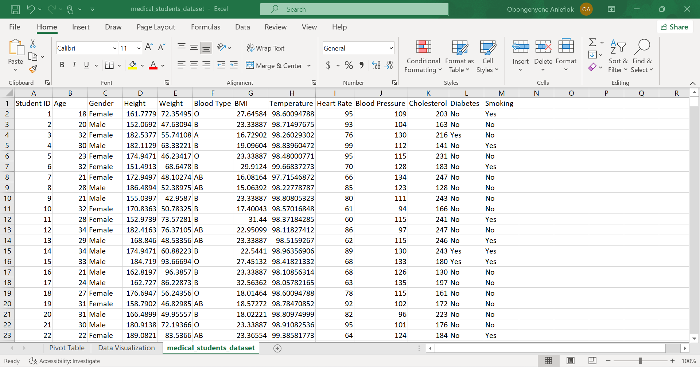
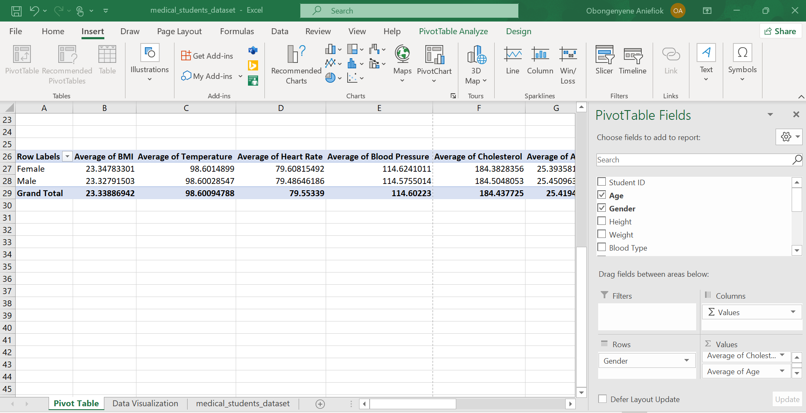
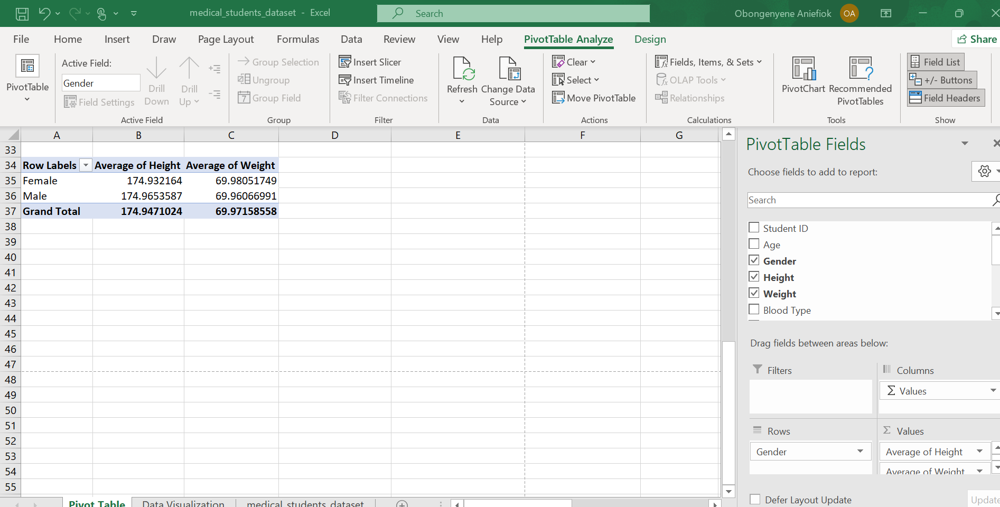
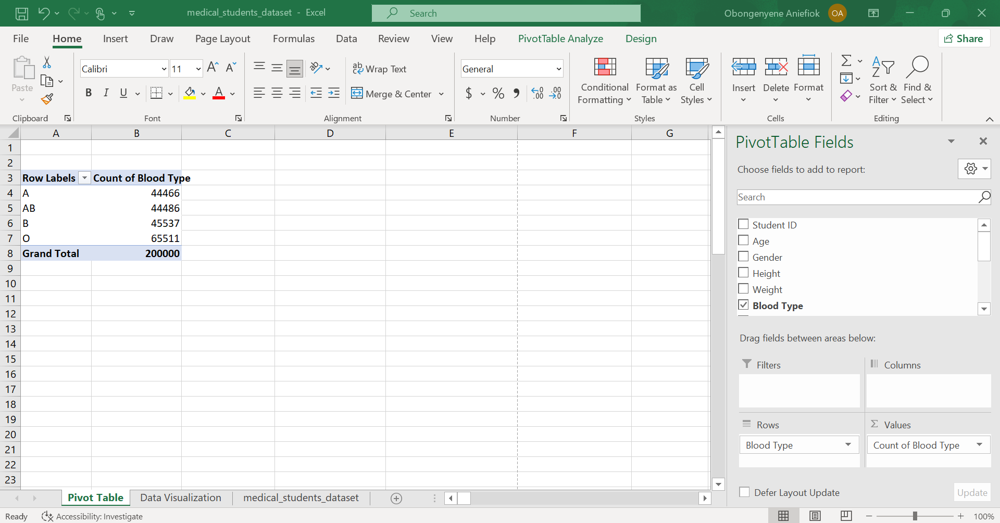
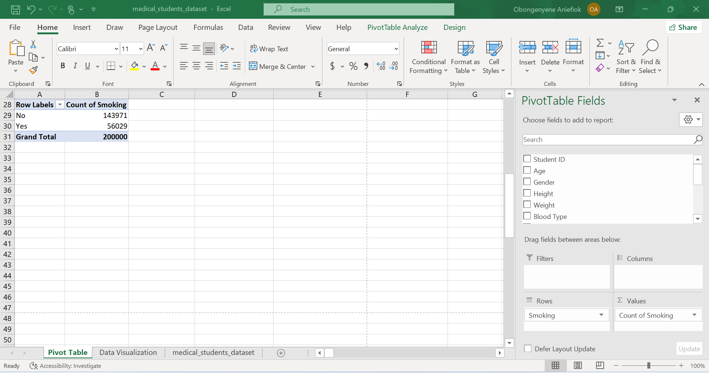
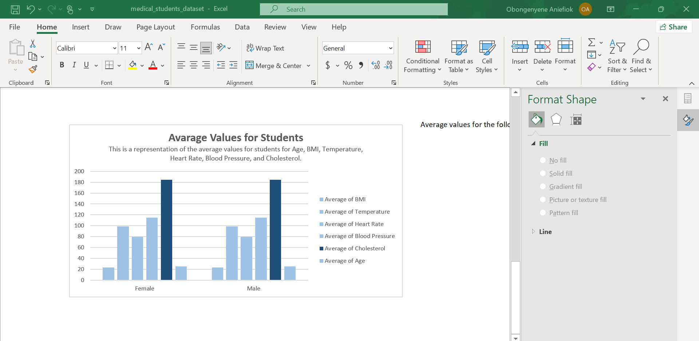
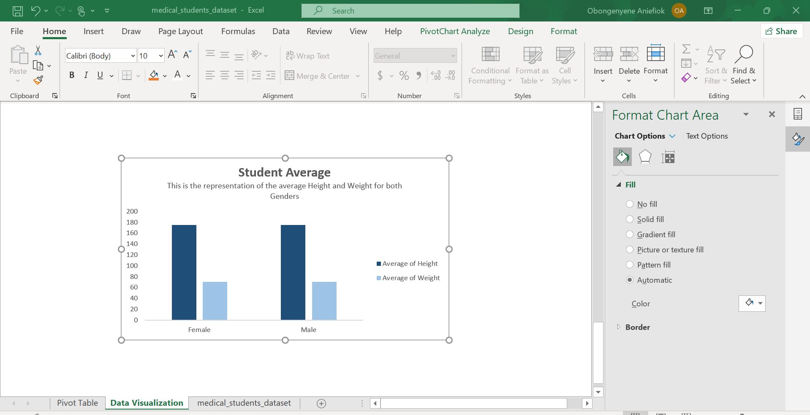
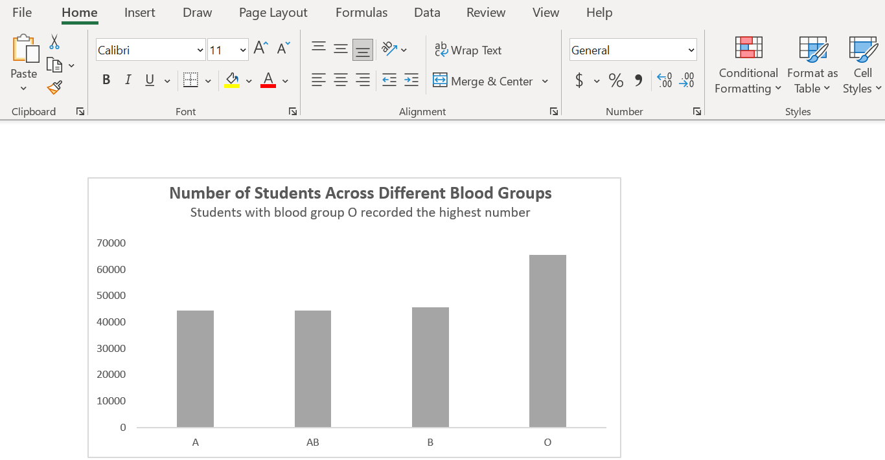
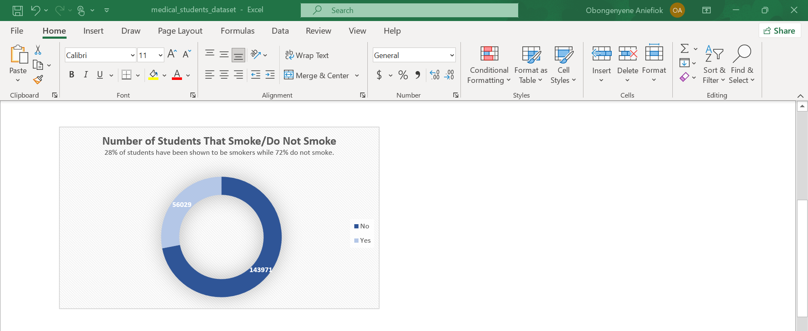
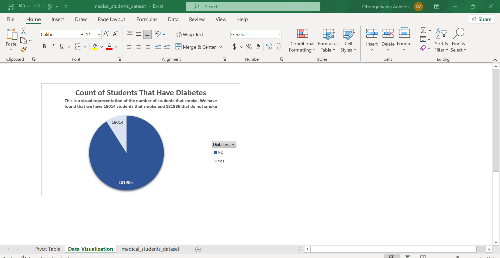

# Task1
## Introduction
After the class, “PIVOT TABLES”, we were given the assignment to create pivot tables using the “Medical Students Data Set" given to us by our facilitator Chinonso Promise that contained the Student ID, Age, Gender, Height, Weight, Blood Type, BMI, Temperature, Heart Rate, Blood Pressure, Cholesterol, Diabetes, and Smoking columns.

## Tasks
Create Pivot Tables displaying the following:
- Average values for the following for Males and Females (Age, BMI, Temperature, Heart Rate, Blood Pressure, and Cholesterol)
- Average Height and Weight for both Genders (in 2 decimal places)
- Number of students across the different Blood Groups
- Number of Students who smoke and those who don’t
- Number of Students who have diabetes and those who don’t
  
## Concept Demonstrated
Use of Pivot Tables

## Raw Data Set

## Task Solutions
For the first task which is getting the average values for the following for Males and Females (Age, BMI, Temperature, Heart Rate, Blood Pressure, and Cholesterol), I went to insert, then pivot tables. This gave me the option to create the table on either the current sheet or the new sheet. I choose the option to create a new sheet. Then, on the pivot field, I put the gender on the “row field” and input the criteria into the value field making sure that I changed the value field setting to average as that is what we are looking for. This gave the average of each of the criteria we are looking for.

To get the Average Height and Weight for both Genders, I created a pivot table, then inputted the gender on the “row field” and the height and weight criteria in the value field making sure that I changed the value field setting to average so that we can get their average.

To get the number of students across the different Blood Groups, I inserted a pivot table, then inputted “Blood Type in the row field. Afterward, I again inputted the blood type into the “Value Field, ensuring that I changed the value field setting to count of because we are looking for the numb er of count which also means the count of students. I did the same thing for the questions “Number of Students who smoke and those who don’t and Number of Students who have diabetes and those who don’t, making sure that for each, I changed the row and value field to the appropriate ones.

# Task2
## Introduction
For this task, we were asked to perform tasks on Data Visualization using the pivot tables we created from the “Medical Students Data Set" given to us by our facilitator. 

## Concept Demonstrated
Data Visualization

## Task Solutions

